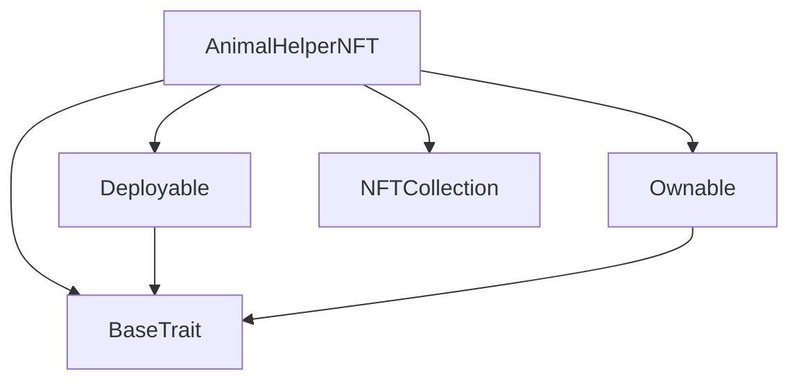
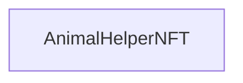

# Tact compilation report
Contract: AnimalHelperNFT
BoC Size: 1246 bytes

## Structures (Structs and Messages)
Total structures: 24

### DataSize
TL-B: `_ cells:int257 bits:int257 refs:int257 = DataSize`
Signature: `DataSize{cells:int257,bits:int257,refs:int257}`

### StateInit
TL-B: `_ code:^cell data:^cell = StateInit`
Signature: `StateInit{code:^cell,data:^cell}`

### Context
TL-B: `_ bounceable:bool sender:address value:int257 raw:^slice = Context`
Signature: `Context{bounceable:bool,sender:address,value:int257,raw:^slice}`

### SendParameters
TL-B: `_ mode:int257 body:Maybe ^cell code:Maybe ^cell data:Maybe ^cell value:int257 to:address bounce:bool = SendParameters`
Signature: `SendParameters{mode:int257,body:Maybe ^cell,code:Maybe ^cell,data:Maybe ^cell,value:int257,to:address,bounce:bool}`

### MessageParameters
TL-B: `_ mode:int257 body:Maybe ^cell value:int257 to:address bounce:bool = MessageParameters`
Signature: `MessageParameters{mode:int257,body:Maybe ^cell,value:int257,to:address,bounce:bool}`

### DeployParameters
TL-B: `_ mode:int257 body:Maybe ^cell value:int257 bounce:bool init:StateInit{code:^cell,data:^cell} = DeployParameters`
Signature: `DeployParameters{mode:int257,body:Maybe ^cell,value:int257,bounce:bool,init:StateInit{code:^cell,data:^cell}}`

### StdAddress
TL-B: `_ workchain:int8 address:uint256 = StdAddress`
Signature: `StdAddress{workchain:int8,address:uint256}`

### VarAddress
TL-B: `_ workchain:int32 address:^slice = VarAddress`
Signature: `VarAddress{workchain:int32,address:^slice}`

### BasechainAddress
TL-B: `_ hash:Maybe int257 = BasechainAddress`
Signature: `BasechainAddress{hash:Maybe int257}`

### Deploy
TL-B: `deploy#946a98b6 queryId:uint64 = Deploy`
Signature: `Deploy{queryId:uint64}`

### DeployOk
TL-B: `deploy_ok#aff90f57 queryId:uint64 = DeployOk`
Signature: `DeployOk{queryId:uint64}`

### FactoryDeploy
TL-B: `factory_deploy#6d0ff13b queryId:uint64 cashback:address = FactoryDeploy`
Signature: `FactoryDeploy{queryId:uint64,cashback:address}`

### ChangeOwner
TL-B: `change_owner#819dbe99 queryId:uint64 newOwner:address = ChangeOwner`
Signature: `ChangeOwner{queryId:uint64,newOwner:address}`

### ChangeOwnerOk
TL-B: `change_owner_ok#327b2b4a queryId:uint64 newOwner:address = ChangeOwnerOk`
Signature: `ChangeOwnerOk{queryId:uint64,newOwner:address}`

### GetCollectionDataMessage
TL-B: `get_collection_data_message#c9bcc977  = GetCollectionDataMessage`
Signature: `GetCollectionDataMessage{}`

### NFTAddressByIndexMessage
TL-B: `nft_address_by_index_message#b595f97d index:uint64 = NFTAddressByIndexMessage`
Signature: `NFTAddressByIndexMessage{index:uint64}`

### GetNFTContentMessage
TL-B: `get_nft_content_message#a0ddd1b8 index:uint64 = GetNFTContentMessage`
Signature: `GetNFTContentMessage{index:uint64}`

### MintNFTMessage
TL-B: `mint_nft_message#cb1487c9 recipient:address batchCount:uint32 = MintNFTMessage`
Signature: `MintNFTMessage{recipient:address,batchCount:uint32}`

### UpdateTokenContractMessage
TL-B: `update_token_contract_message#a2ba90d5 new_token_contract:address = UpdateTokenContractMessage`
Signature: `UpdateTokenContractMessage{new_token_contract:address}`

### UpdateContentMessage
TL-B: `update_content_message#24c279cb new_content:^cell = UpdateContentMessage`
Signature: `UpdateContentMessage{new_content:^cell}`

### EmergencyWithdrawMessage
TL-B: `emergency_withdraw_message#fac86711  = EmergencyWithdrawMessage`
Signature: `EmergencyWithdrawMessage{}`

### NFTData
TL-B: `_ index:int257 collection:address owner:address content:^cell = NFTData`
Signature: `NFTData{index:int257,collection:address,owner:address,content:^cell}`

### CollectionData
TL-B: `_ nextIndex:int257 owner:address content:^cell nftItemCode:^cell = CollectionData`
Signature: `CollectionData{nextIndex:int257,owner:address,content:^cell,nftItemCode:^cell}`

### AnimalHelperNFT$Data
TL-B: `_ owner:address nextIndex:int257 content:^cell nftItemCode:^cell tokenContract:address = AnimalHelperNFT`
Signature: `AnimalHelperNFT{owner:address,nextIndex:int257,content:^cell,nftItemCode:^cell,tokenContract:address}`

## Get methods
Total get methods: 1

## owner
No arguments

## Exit codes
* 2: Stack underflow
* 3: Stack overflow
* 4: Integer overflow
* 5: Integer out of expected range
* 6: Invalid opcode
* 7: Type check error
* 8: Cell overflow
* 9: Cell underflow
* 10: Dictionary error
* 11: 'Unknown' error
* 12: Fatal error
* 13: Out of gas error
* 14: Virtualization error
* 32: Action list is invalid
* 33: Action list is too long
* 34: Action is invalid or not supported
* 35: Invalid source address in outbound message
* 36: Invalid destination address in outbound message
* 37: Not enough Toncoin
* 38: Not enough extra currencies
* 39: Outbound message does not fit into a cell after rewriting
* 40: Cannot process a message
* 41: Library reference is null
* 42: Library change action error
* 43: Exceeded maximum number of cells in the library or the maximum depth of the Merkle tree
* 50: Account state size exceeded limits
* 128: Null reference exception
* 129: Invalid serialization prefix
* 130: Invalid incoming message
* 131: Constraints error
* 132: Access denied
* 133: Contract stopped
* 134: Invalid argument
* 135: Code of a contract was not found
* 136: Invalid standard address
* 138: Not a basechain address
* 14534: Not owner
* 41925: Insufficient funds for minting
* 42435: Not authorized

## Trait inheritance diagram

## Contract dependency diagram

