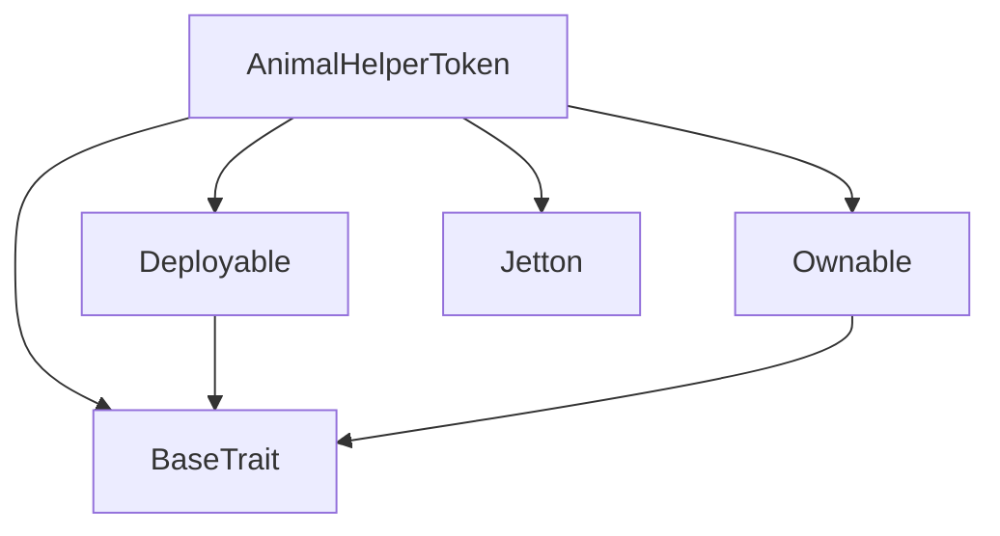
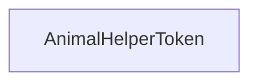

# Tact compilation report
Contract: AnimalHelperToken
BoC Size: 2602 bytes

## Structures (Structs and Messages)
Total structures: 25

### DataSize
TL-B: `_ cells:int257 bits:int257 refs:int257 = DataSize`
Signature: `DataSize{cells:int257,bits:int257,refs:int257}`

### StateInit
TL-B: `_ code:^cell data:^cell = StateInit`
Signature: `StateInit{code:^cell,data:^cell}`

### Context
TL-B: `_ bounceable:bool sender:address value:int257 raw:^slice = Context`
Signature: `Context{bounceable:bool,sender:address,value:int257,raw:^slice}`

### SendParameters
TL-B: `_ mode:int257 body:Maybe ^cell code:Maybe ^cell data:Maybe ^cell value:int257 to:address bounce:bool = SendParameters`
Signature: `SendParameters{mode:int257,body:Maybe ^cell,code:Maybe ^cell,data:Maybe ^cell,value:int257,to:address,bounce:bool}`

### MessageParameters
TL-B: `_ mode:int257 body:Maybe ^cell value:int257 to:address bounce:bool = MessageParameters`
Signature: `MessageParameters{mode:int257,body:Maybe ^cell,value:int257,to:address,bounce:bool}`

### DeployParameters
TL-B: `_ mode:int257 body:Maybe ^cell value:int257 bounce:bool init:StateInit{code:^cell,data:^cell} = DeployParameters`
Signature: `DeployParameters{mode:int257,body:Maybe ^cell,value:int257,bounce:bool,init:StateInit{code:^cell,data:^cell}}`

### StdAddress
TL-B: `_ workchain:int8 address:uint256 = StdAddress`
Signature: `StdAddress{workchain:int8,address:uint256}`

### VarAddress
TL-B: `_ workchain:int32 address:^slice = VarAddress`
Signature: `VarAddress{workchain:int32,address:^slice}`

### BasechainAddress
TL-B: `_ hash:Maybe int257 = BasechainAddress`
Signature: `BasechainAddress{hash:Maybe int257}`

### Deploy
TL-B: `deploy#946a98b6 queryId:uint64 = Deploy`
Signature: `Deploy{queryId:uint64}`

### DeployOk
TL-B: `deploy_ok#aff90f57 queryId:uint64 = DeployOk`
Signature: `DeployOk{queryId:uint64}`

### FactoryDeploy
TL-B: `factory_deploy#6d0ff13b queryId:uint64 cashback:address = FactoryDeploy`
Signature: `FactoryDeploy{queryId:uint64,cashback:address}`

### ChangeOwner
TL-B: `change_owner#819dbe99 queryId:uint64 newOwner:address = ChangeOwner`
Signature: `ChangeOwner{queryId:uint64,newOwner:address}`

### ChangeOwnerOk
TL-B: `change_owner_ok#327b2b4a queryId:uint64 newOwner:address = ChangeOwnerOk`
Signature: `ChangeOwnerOk{queryId:uint64,newOwner:address}`

### JettonData
TL-B: `_ totalSupply:int257 mintable:bool owner:address content:^cell walletCode:^cell tokenRate:int257 = JettonData`
Signature: `JettonData{totalSupply:int257,mintable:bool,owner:address,content:^cell,walletCode:^cell,tokenRate:int257}`

### GetWalletAddress
TL-B: `get_wallet_address#c5b31108 owner_address:address = GetWalletAddress`
Signature: `GetWalletAddress{owner_address:address}`

### UpdateDistributionContractMessage
TL-B: `update_distribution_contract_message#d66feac7 queryId:int257 new_address:address = UpdateDistributionContractMessage`
Signature: `UpdateDistributionContractMessage{queryId:int257,new_address:address}`

### UpdateNFTContractMessage
TL-B: `update_nft_contract_message#8a53046b queryId:int257 new_address:address = UpdateNFTContractMessage`
Signature: `UpdateNFTContractMessage{queryId:int257,new_address:address}`

### UpdateContentMessage
TL-B: `update_content_message#54a249e0 queryId:int257 new_content:^cell = UpdateContentMessage`
Signature: `UpdateContentMessage{queryId:int257,new_content:^cell}`

### BuyTokensMessage
TL-B: `buy_tokens_message#daaf0bd4 queryId:int257 = BuyTokensMessage`
Signature: `BuyTokensMessage{queryId:int257}`

### ToggleMintingMessage
TL-B: `toggle_minting_message#6e3633eb queryId:int257 = ToggleMintingMessage`
Signature: `ToggleMintingMessage{queryId:int257}`

### EmergencyWithdrawMessage
TL-B: `emergency_withdraw_message#e5d4396e queryId:int257 = EmergencyWithdrawMessage`
Signature: `EmergencyWithdrawMessage{queryId:int257}`

### UpdateTokenRateMessage
TL-B: `update_token_rate_message#51d31267 queryId:int257 new_rate:int257 = UpdateTokenRateMessage`
Signature: `UpdateTokenRateMessage{queryId:int257,new_rate:int257}`

### AdminParams
TL-B: `_ tempAdmin:address recoveryAddress:address lockUntil:int257 = AdminParams`
Signature: `AdminParams{tempAdmin:address,recoveryAddress:address,lockUntil:int257}`

### AnimalHelperToken$Data
TL-B: `_ totalSupply:int257 maxSupply:int257 mintable:bool owner:address content:^cell walletCode:^cell distributionContract:address nftContract:address tokenRate:int257 adminParams:AdminParams{tempAdmin:address,recoveryAddress:address,lockUntil:int257} = AnimalHelperToken`
Signature: `AnimalHelperToken{totalSupply:int257,maxSupply:int257,mintable:bool,owner:address,content:^cell,walletCode:^cell,distributionContract:address,nftContract:address,tokenRate:int257,adminParams:AdminParams{tempAdmin:address,recoveryAddress:address,lockUntil:int257}}`

## Get methods
Total get methods: 1

## owner
No arguments

## Exit codes
* 2: Stack underflow
* 3: Stack overflow
* 4: Integer overflow
* 5: Integer out of expected range
* 6: Invalid opcode
* 7: Type check error
* 8: Cell overflow
* 9: Cell underflow
* 10: Dictionary error
* 11: 'Unknown' error
* 12: Fatal error
* 13: Out of gas error
* 14: Virtualization error
* 32: Action list is invalid
* 33: Action list is too long
* 34: Action is invalid or not supported
* 35: Invalid source address in outbound message
* 36: Invalid destination address in outbound message
* 37: Not enough Toncoin
* 38: Not enough extra currencies
* 39: Outbound message does not fit into a cell after rewriting
* 40: Cannot process a message
* 41: Library reference is null
* 42: Library change action error
* 43: Exceeded maximum number of cells in the library or the maximum depth of the Merkle tree
* 50: Account state size exceeded limits
* 128: Null reference exception
* 129: Invalid serialization prefix
* 130: Invalid incoming message
* 131: Constraints error
* 132: Access denied
* 133: Contract stopped
* 134: Invalid argument
* 135: Code of a contract was not found
* 136: Invalid standard address
* 138: Not a basechain address
* 6765: Exceeds maximum token supply
* 14796: Exceeds max supply
* 23144: Not recovery address
* 31651: Admin functions are temporarily locked
* 42435: Not authorized
* 50578: Only owner can set recovery address
* 51754: Insufficient funds
* 54566: Minting is paused
* 63477: Cooldown period not passed
* 63513: Token rate must be positive
* 63750: Only owner can set temp admin

## Trait inheritance diagram

## Contract dependency diagram

