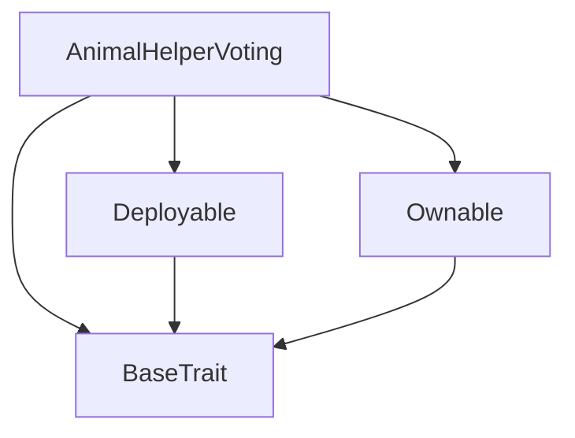

# Tact compilation report
Contract: AnimalHelperVoting
BoC Size: 2556 bytes

## Structures (Structs and Messages)
Total structures: 27

### DataSize
TL-B: `_ cells:int257 bits:int257 refs:int257 = DataSize`
Signature: `DataSize{cells:int257,bits:int257,refs:int257}`

### StateInit
TL-B: `_ code:^cell data:^cell = StateInit`
Signature: `StateInit{code:^cell,data:^cell}`

### Context
TL-B: `_ bounceable:bool sender:address value:int257 raw:^slice = Context`
Signature: `Context{bounceable:bool,sender:address,value:int257,raw:^slice}`

### SendParameters
TL-B: `_ mode:int257 body:Maybe ^cell code:Maybe ^cell data:Maybe ^cell value:int257 to:address bounce:bool = SendParameters`
Signature: `SendParameters{mode:int257,body:Maybe ^cell,code:Maybe ^cell,data:Maybe ^cell,value:int257,to:address,bounce:bool}`

### MessageParameters
TL-B: `_ mode:int257 body:Maybe ^cell value:int257 to:address bounce:bool = MessageParameters`
Signature: `MessageParameters{mode:int257,body:Maybe ^cell,value:int257,to:address,bounce:bool}`

### DeployParameters
TL-B: `_ mode:int257 body:Maybe ^cell value:int257 bounce:bool init:StateInit{code:^cell,data:^cell} = DeployParameters`
Signature: `DeployParameters{mode:int257,body:Maybe ^cell,value:int257,bounce:bool,init:StateInit{code:^cell,data:^cell}}`

### StdAddress
TL-B: `_ workchain:int8 address:uint256 = StdAddress`
Signature: `StdAddress{workchain:int8,address:uint256}`

### VarAddress
TL-B: `_ workchain:int32 address:^slice = VarAddress`
Signature: `VarAddress{workchain:int32,address:^slice}`

### BasechainAddress
TL-B: `_ hash:Maybe int257 = BasechainAddress`
Signature: `BasechainAddress{hash:Maybe int257}`

### Deploy
TL-B: `deploy#946a98b6 queryId:uint64 = Deploy`
Signature: `Deploy{queryId:uint64}`

### DeployOk
TL-B: `deploy_ok#aff90f57 queryId:uint64 = DeployOk`
Signature: `DeployOk{queryId:uint64}`

### FactoryDeploy
TL-B: `factory_deploy#6d0ff13b queryId:uint64 cashback:address = FactoryDeploy`
Signature: `FactoryDeploy{queryId:uint64,cashback:address}`

### ChangeOwner
TL-B: `change_owner#819dbe99 queryId:uint64 newOwner:address = ChangeOwner`
Signature: `ChangeOwner{queryId:uint64,newOwner:address}`

### ChangeOwnerOk
TL-B: `change_owner_ok#327b2b4a queryId:uint64 newOwner:address = ChangeOwnerOk`
Signature: `ChangeOwnerOk{queryId:uint64,newOwner:address}`

### StartVotingMessage
TL-B: `start_voting_message#ba916f52  = StartVotingMessage`
Signature: `StartVotingMessage{}`

### AddProposalMessage
TL-B: `add_proposal_message#920caa6e shelter_address:address name:^string description:^string = AddProposalMessage`
Signature: `AddProposalMessage{shelter_address:address,name:^string,description:^string}`

### VoteMessage
TL-B: `vote_message#39aff01f proposal_id:uint32 = VoteMessage`
Signature: `VoteMessage{proposal_id:uint32}`

### FinalizeVotingMessage
TL-B: `finalize_voting_message#0bec5009  = FinalizeVotingMessage`
Signature: `FinalizeVotingMessage{}`

### GetVotingStatusMessage
TL-B: `get_voting_status_message#1816f675  = GetVotingStatusMessage`
Signature: `GetVotingStatusMessage{}`

### GetProposalMessage
TL-B: `get_proposal_message#88f64278 proposal_id:uint32 = GetProposalMessage`
Signature: `GetProposalMessage{proposal_id:uint32}`

### GetLastResultsMessage
TL-B: `get_last_results_message#90043c4e  = GetLastResultsMessage`
Signature: `GetLastResultsMessage{}`

### UpdateMinBalanceMessage
TL-B: `update_min_balance_message#b6fb639f min_balance:uint64 = UpdateMinBalanceMessage`
Signature: `UpdateMinBalanceMessage{min_balance:uint64}`

### UpdateTokenContractMessage
TL-B: `update_token_contract_message#0d32cf13 new_address:address = UpdateTokenContractMessage`
Signature: `UpdateTokenContractMessage{new_address:address}`

### UpdateAnimalHelperPoolMessage
TL-B: `update_animal_helper_pool_message#c6e77e3d new_address:address = UpdateAnimalHelperPoolMessage`
Signature: `UpdateAnimalHelperPoolMessage{new_address:address}`

### EmergencyWithdrawMessage
TL-B: `emergency_withdraw_message#fac86711  = EmergencyWithdrawMessage`
Signature: `EmergencyWithdrawMessage{}`

### Proposal
TL-B: `_ id:int257 shelterAddress:address name:^string description:^string votes:int257 = Proposal`
Signature: `Proposal{id:int257,shelterAddress:address,name:^string,description:^string,votes:int257}`

### AnimalHelperVoting$Data
TL-B: `_ owner:address tokenContract:address animalHelperPool:address proposalsCount:int257 votingActive:bool votingStartTime:int257 votingEndTime:int257 minTokenBalance:int257 lastVotingResults:^cell proposals:dict<int, ^Proposal{id:int257,shelterAddress:address,name:^string,description:^string,votes:int257}> votes:dict<address, int> voterTokenBalances:dict<address, int> = AnimalHelperVoting`
Signature: `AnimalHelperVoting{owner:address,tokenContract:address,animalHelperPool:address,proposalsCount:int257,votingActive:bool,votingStartTime:int257,votingEndTime:int257,minTokenBalance:int257,lastVotingResults:^cell,proposals:dict<int, ^Proposal{id:int257,shelterAddress:address,name:^string,description:^string,votes:int257}>,votes:dict<address, int>,voterTokenBalances:dict<address, int>}`

## Get methods
Total get methods: 1

## owner
No arguments

## Exit codes
* 2: Stack underflow
* 3: Stack overflow
* 4: Integer overflow
* 5: Integer out of expected range
* 6: Invalid opcode
* 7: Type check error
* 8: Cell overflow
* 9: Cell underflow
* 10: Dictionary error
* 11: 'Unknown' error
* 12: Fatal error
* 13: Out of gas error
* 14: Virtualization error
* 32: Action list is invalid
* 33: Action list is too long
* 34: Action is invalid or not supported
* 35: Invalid source address in outbound message
* 36: Invalid destination address in outbound message
* 37: Not enough Toncoin
* 38: Not enough extra currencies
* 39: Outbound message does not fit into a cell after rewriting
* 40: Cannot process a message
* 41: Library reference is null
* 42: Library change action error
* 43: Exceeded maximum number of cells in the library or the maximum depth of the Merkle tree
* 50: Account state size exceeded limits
* 128: Null reference exception
* 129: Invalid serialization prefix
* 130: Invalid incoming message
* 131: Constraints error
* 132: Access denied
* 133: Contract stopped
* 134: Invalid argument
* 135: Code of a contract was not found
* 136: Invalid standard address
* 138: Not a basechain address
* 8246: Voting not active
* 14534: Not owner
* 15501: Voting period ended
* 18228: Invalid proposal ID
* 21906: No active voting
* 23911: Insufficient token balance
* 24933: Voting already active
* 57254: Not allowed or voting not ended
* 59369: Already voted

## Trait inheritance diagram

## Contract dependency diagram

