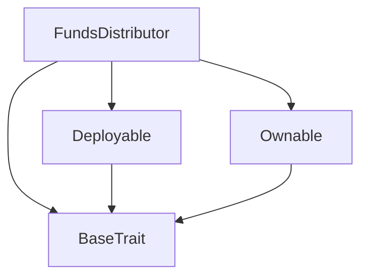
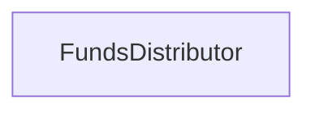

# Tact compilation report
Contract: FundsDistributor
BoC Size: 5067 bytes

## Structures (Structs and Messages)
Total structures: 25

### DataSize
TL-B: `_ cells:int257 bits:int257 refs:int257 = DataSize`
Signature: `DataSize{cells:int257,bits:int257,refs:int257}`

### StateInit
TL-B: `_ code:^cell data:^cell = StateInit`
Signature: `StateInit{code:^cell,data:^cell}`

### Context
TL-B: `_ bounceable:bool sender:address value:int257 raw:^slice = Context`
Signature: `Context{bounceable:bool,sender:address,value:int257,raw:^slice}`

### SendParameters
TL-B: `_ mode:int257 body:Maybe ^cell code:Maybe ^cell data:Maybe ^cell value:int257 to:address bounce:bool = SendParameters`
Signature: `SendParameters{mode:int257,body:Maybe ^cell,code:Maybe ^cell,data:Maybe ^cell,value:int257,to:address,bounce:bool}`

### MessageParameters
TL-B: `_ mode:int257 body:Maybe ^cell value:int257 to:address bounce:bool = MessageParameters`
Signature: `MessageParameters{mode:int257,body:Maybe ^cell,value:int257,to:address,bounce:bool}`

### DeployParameters
TL-B: `_ mode:int257 body:Maybe ^cell value:int257 bounce:bool init:StateInit{code:^cell,data:^cell} = DeployParameters`
Signature: `DeployParameters{mode:int257,body:Maybe ^cell,value:int257,bounce:bool,init:StateInit{code:^cell,data:^cell}}`

### StdAddress
TL-B: `_ workchain:int8 address:uint256 = StdAddress`
Signature: `StdAddress{workchain:int8,address:uint256}`

### VarAddress
TL-B: `_ workchain:int32 address:^slice = VarAddress`
Signature: `VarAddress{workchain:int32,address:^slice}`

### BasechainAddress
TL-B: `_ hash:Maybe int257 = BasechainAddress`
Signature: `BasechainAddress{hash:Maybe int257}`

### Deploy
TL-B: `deploy#946a98b6 queryId:uint64 = Deploy`
Signature: `Deploy{queryId:uint64}`

### DeployOk
TL-B: `deploy_ok#aff90f57 queryId:uint64 = DeployOk`
Signature: `DeployOk{queryId:uint64}`

### FactoryDeploy
TL-B: `factory_deploy#6d0ff13b queryId:uint64 cashback:address = FactoryDeploy`
Signature: `FactoryDeploy{queryId:uint64,cashback:address}`

### ChangeOwner
TL-B: `change_owner#819dbe99 queryId:uint64 newOwner:address = ChangeOwner`
Signature: `ChangeOwner{queryId:uint64,newOwner:address}`

### ChangeOwnerOk
TL-B: `change_owner_ok#327b2b4a queryId:uint64 newOwner:address = ChangeOwnerOk`
Signature: `ChangeOwnerOk{queryId:uint64,newOwner:address}`

### UpdateLiquidityPoolMessage
TL-B: `update_liquidity_pool_message#ae640ee1 queryId:int257 new_address:address = UpdateLiquidityPoolMessage`
Signature: `UpdateLiquidityPoolMessage{queryId:int257,new_address:address}`

### UpdateAnimalHelperPoolMessage
TL-B: `update_animal_helper_pool_message#50e6b55d queryId:int257 new_address:address = UpdateAnimalHelperPoolMessage`
Signature: `UpdateAnimalHelperPoolMessage{queryId:int257,new_address:address}`

### UpdateProjectPoolMessage
TL-B: `update_project_pool_message#b40c268d queryId:int257 new_address:address = UpdateProjectPoolMessage`
Signature: `UpdateProjectPoolMessage{queryId:int257,new_address:address}`

### UpdateInvestorsCreatorsPoolMessage
TL-B: `update_investors_creators_pool_message#c176e2e3 queryId:int257 new_address:address = UpdateInvestorsCreatorsPoolMessage`
Signature: `UpdateInvestorsCreatorsPoolMessage{queryId:int257,new_address:address}`

### UpdateLiquidityLockMessage
TL-B: `update_liquidity_lock_message#21827e7f queryId:int257 new_address:address = UpdateLiquidityLockMessage`
Signature: `UpdateLiquidityLockMessage{queryId:int257,new_address:address}`

### UpdateDistributionRatioMessage
TL-B: `update_distribution_ratio_message#a8208e36 queryId:int257 liq_percent:int257 animal_percent:int257 proj_percent:int257 inv_creat_percent:int257 = UpdateDistributionRatioMessage`
Signature: `UpdateDistributionRatioMessage{queryId:int257,liq_percent:int257,animal_percent:int257,proj_percent:int257,inv_creat_percent:int257}`

### UpdateLockRatioMessage
TL-B: `update_lock_ratio_message#988fa52e queryId:int257 lock_percent:int257 = UpdateLockRatioMessage`
Signature: `UpdateLockRatioMessage{queryId:int257,lock_percent:int257}`

### EmergencyWithdrawMessage
TL-B: `emergency_withdraw_message#e5d4396e queryId:int257 = EmergencyWithdrawMessage`
Signature: `EmergencyWithdrawMessage{queryId:int257}`

### AdminConfig
TL-B: `_ tempAdmin:address recoveryAddress:address lockUntil:int257 proposalId:int257 pendingProposals:dict<int, ^cell> = AdminConfig`
Signature: `AdminConfig{tempAdmin:address,recoveryAddress:address,lockUntil:int257,proposalId:int257,pendingProposals:dict<int, ^cell>}`

### TransactionSummary
TL-B: `_ successCount:int257 failCount:int257 totalSent:int257 = TransactionSummary`
Signature: `TransactionSummary{successCount:int257,failCount:int257,totalSent:int257}`

### FundsDistributor$Data
TL-B: `_ owner:address liquidityPool:address liquidityLock:address animalHelperPool:address projectPool:address investorsCreatorsPool:address liquidityPercent:int257 animalHelperPercent:int257 projectPercent:int257 investorsCreatorsPercent:int257 lockPercent:int257 minDistributionAmount:int257 adminConfig:AdminConfig{tempAdmin:address,recoveryAddress:address,lockUntil:int257,proposalId:int257,pendingProposals:dict<int, ^cell>} transactionMetrics:TransactionSummary{successCount:int257,failCount:int257,totalSent:int257} = FundsDistributor`
Signature: `FundsDistributor{owner:address,liquidityPool:address,liquidityLock:address,animalHelperPool:address,projectPool:address,investorsCreatorsPool:address,liquidityPercent:int257,animalHelperPercent:int257,projectPercent:int257,investorsCreatorsPercent:int257,lockPercent:int257,minDistributionAmount:int257,adminConfig:AdminConfig{tempAdmin:address,recoveryAddress:address,lockUntil:int257,proposalId:int257,pendingProposals:dict<int, ^cell>},transactionMetrics:TransactionSummary{successCount:int257,failCount:int257,totalSent:int257}}`

## Get methods
Total get methods: 1

## owner
No arguments

## Exit codes
* 2: Stack underflow
* 3: Stack overflow
* 4: Integer overflow
* 5: Integer out of expected range
* 6: Invalid opcode
* 7: Type check error
* 8: Cell overflow
* 9: Cell underflow
* 10: Dictionary error
* 11: 'Unknown' error
* 12: Fatal error
* 13: Out of gas error
* 14: Virtualization error
* 32: Action list is invalid
* 33: Action list is too long
* 34: Action is invalid or not supported
* 35: Invalid source address in outbound message
* 36: Invalid destination address in outbound message
* 37: Not enough Toncoin
* 38: Not enough extra currencies
* 39: Outbound message does not fit into a cell after rewriting
* 40: Cannot process a message
* 41: Library reference is null
* 42: Library change action error
* 43: Exceeded maximum number of cells in the library or the maximum depth of the Merkle tree
* 50: Account state size exceeded limits
* 128: Null reference exception
* 129: Invalid serialization prefix
* 130: Invalid incoming message
* 131: Constraints error
* 132: Access denied
* 133: Contract stopped
* 134: Invalid argument
* 135: Code of a contract was not found
* 136: Invalid standard address
* 138: Not a basechain address
* 4989: Invalid investors creators pool address
* 7826: Invalid project pool address
* 8723: Proposal expired
* 13131: Distribution error: sum exceeds amount
* 13935: Cannot confirm own proposal
* 15038: Only admin can propose actions
* 23144: Not recovery address
* 29638: Invalid animal helper pool address
* 31651: Admin functions are temporarily locked
* 33719: Amount too small for distribution
* 36917: Invalid liquidity pool address
* 38995: Invalid lock percentage
* 42435: Not authorized
* 49912: Invalid liquidity lock address
* 50578: Only owner can set recovery address
* 52463: Total percentage must be 100%
* 59037: Proposal does not exist
* 61135: Amount must be positive
* 63477: Cooldown period not passed
* 63750: Only owner can set temp admin

## Trait inheritance diagram

## Contract dependency diagram

