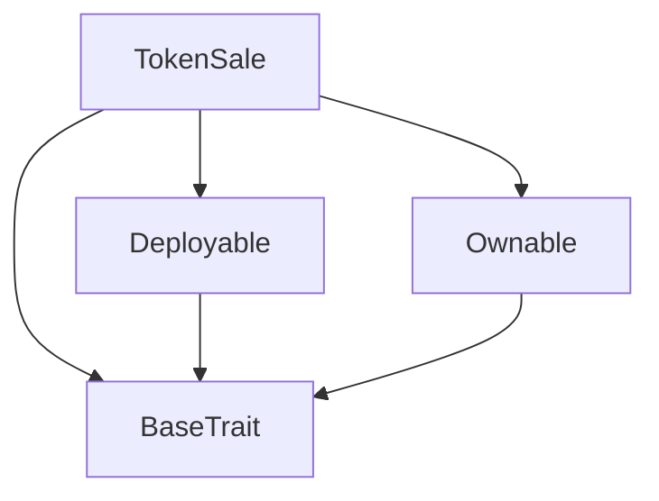
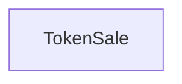

# Tact compilation report
Contract: TokenSale
BoC Size: 1018 bytes

## Structures (Structs and Messages)
Total structures: 25

### DataSize
TL-B: `_ cells:int257 bits:int257 refs:int257 = DataSize`
Signature: `DataSize{cells:int257,bits:int257,refs:int257}`

### StateInit
TL-B: `_ code:^cell data:^cell = StateInit`
Signature: `StateInit{code:^cell,data:^cell}`

### Context
TL-B: `_ bounceable:bool sender:address value:int257 raw:^slice = Context`
Signature: `Context{bounceable:bool,sender:address,value:int257,raw:^slice}`

### SendParameters
TL-B: `_ mode:int257 body:Maybe ^cell code:Maybe ^cell data:Maybe ^cell value:int257 to:address bounce:bool = SendParameters`
Signature: `SendParameters{mode:int257,body:Maybe ^cell,code:Maybe ^cell,data:Maybe ^cell,value:int257,to:address,bounce:bool}`

### MessageParameters
TL-B: `_ mode:int257 body:Maybe ^cell value:int257 to:address bounce:bool = MessageParameters`
Signature: `MessageParameters{mode:int257,body:Maybe ^cell,value:int257,to:address,bounce:bool}`

### DeployParameters
TL-B: `_ mode:int257 body:Maybe ^cell value:int257 bounce:bool init:StateInit{code:^cell,data:^cell} = DeployParameters`
Signature: `DeployParameters{mode:int257,body:Maybe ^cell,value:int257,bounce:bool,init:StateInit{code:^cell,data:^cell}}`

### StdAddress
TL-B: `_ workchain:int8 address:uint256 = StdAddress`
Signature: `StdAddress{workchain:int8,address:uint256}`

### VarAddress
TL-B: `_ workchain:int32 address:^slice = VarAddress`
Signature: `VarAddress{workchain:int32,address:^slice}`

### BasechainAddress
TL-B: `_ hash:Maybe int257 = BasechainAddress`
Signature: `BasechainAddress{hash:Maybe int257}`

### Deploy
TL-B: `deploy#946a98b6 queryId:uint64 = Deploy`
Signature: `Deploy{queryId:uint64}`

### DeployOk
TL-B: `deploy_ok#aff90f57 queryId:uint64 = DeployOk`
Signature: `DeployOk{queryId:uint64}`

### FactoryDeploy
TL-B: `factory_deploy#6d0ff13b queryId:uint64 cashback:address = FactoryDeploy`
Signature: `FactoryDeploy{queryId:uint64,cashback:address}`

### ChangeOwner
TL-B: `change_owner#819dbe99 queryId:uint64 newOwner:address = ChangeOwner`
Signature: `ChangeOwner{queryId:uint64,newOwner:address}`

### ChangeOwnerOk
TL-B: `change_owner_ok#327b2b4a queryId:uint64 newOwner:address = ChangeOwnerOk`
Signature: `ChangeOwnerOk{queryId:uint64,newOwner:address}`

### GetWalletDataMessage
TL-B: `get_wallet_data_message#b7c72f59  = GetWalletDataMessage`
Signature: `GetWalletDataMessage{}`

### InternalTransferMessage
TL-B: `internal_transfer_message#997c01bd query_id:uint64 amount:coins from:address response_destination:address forward_ton_amount:coins forward_payload:Maybe ^cell = InternalTransferMessage`
Signature: `InternalTransferMessage{query_id:uint64,amount:coins,from:address,response_destination:address,forward_ton_amount:coins,forward_payload:Maybe ^cell}`

### TransferMessage
TL-B: `transfer_message#b95d0502 query_id:uint64 amount:coins destination:address response_destination:address custom_payload:Maybe ^cell forward_ton_amount:coins forward_payload:Maybe ^cell = TransferMessage`
Signature: `TransferMessage{query_id:uint64,amount:coins,destination:address,response_destination:address,custom_payload:Maybe ^cell,forward_ton_amount:coins,forward_payload:Maybe ^cell}`

### BurnMessage
TL-B: `burn_message#1ffec056 query_id:uint64 amount:coins response_destination:address = BurnMessage`
Signature: `BurnMessage{query_id:uint64,amount:coins,response_destination:address}`

### JettonWalletData
TL-B: `_ balance:int257 owner:address jettonMaster:address walletCode:^cell = JettonWalletData`
Signature: `JettonWalletData{balance:int257,owner:address,jettonMaster:address,walletCode:^cell}`

### JettonWallet$Data
TL-B: `_ balance:int257 owner:address jettonMaster:address = JettonWallet`
Signature: `JettonWallet{balance:int257,owner:address,jettonMaster:address}`

### BuyTokens
TL-B: `buy_tokens#57239763  = BuyTokens`
Signature: `BuyTokens{}`

### WithdrawRemaining
TL-B: `withdraw_remaining#1af4b568 queryId:int257 = WithdrawRemaining`
Signature: `WithdrawRemaining{queryId:int257}`

### UpdateRate
TL-B: `update_rate#8ee943da queryId:int257 newRate:int257 = UpdateRate`
Signature: `UpdateRate{queryId:int257,newRate:int257}`

### TokenSale$Data
TL-B: `_ owner:address jettonMaster:address jettonWallet:address fundsDistributor:address tokenRate:int257 isActive:bool = TokenSale`
Signature: `TokenSale{owner:address,jettonMaster:address,jettonWallet:address,fundsDistributor:address,tokenRate:int257,isActive:bool}`

### SaleData
TL-B: `_ jettonWallet:address fundsDistributor:address isActive:bool tokenRate:int257 = SaleData`
Signature: `SaleData{jettonWallet:address,fundsDistributor:address,isActive:bool,tokenRate:int257}`

## Get methods
Total get methods: 2

## getSaleData
No arguments

## owner
No arguments

## Exit codes
* 2: Stack underflow
* 3: Stack overflow
* 4: Integer overflow
* 5: Integer out of expected range
* 6: Invalid opcode
* 7: Type check error
* 8: Cell overflow
* 9: Cell underflow
* 10: Dictionary error
* 11: 'Unknown' error
* 12: Fatal error
* 13: Out of gas error
* 14: Virtualization error
* 32: Action list is invalid
* 33: Action list is too long
* 34: Action is invalid or not supported
* 35: Invalid source address in outbound message
* 36: Invalid destination address in outbound message
* 37: Not enough Toncoin
* 38: Not enough extra currencies
* 39: Outbound message does not fit into a cell after rewriting
* 40: Cannot process a message
* 41: Library reference is null
* 42: Library change action error
* 43: Exceeded maximum number of cells in the library or the maximum depth of the Merkle tree
* 50: Account state size exceeded limits
* 128: Null reference exception
* 129: Invalid serialization prefix
* 130: Invalid incoming message
* 131: Constraints error
* 132: Access denied
* 133: Contract stopped
* 134: Invalid argument
* 135: Code of a contract was not found
* 136: Invalid standard address
* 138: Not a basechain address
* 4429: Invalid sender
* 14534: Not owner
* 17508: Cannot withdraw while sale is active
* 18189: Token sale is not active
* 37795: Insufficient funds to buy tokens
* 54615: Insufficient balance
* 62335: Invalid token rate

## Trait inheritance diagram

## Contract dependency diagram

